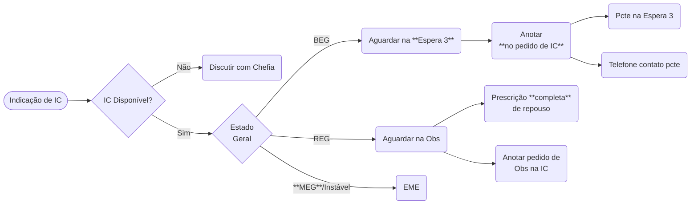

# Solicitação de Interconsultas

{: .warning }
Sempre orientar paciente e acompanhantes que ICs **DEMORAM**!

{: .info }
Pedidos de IC são quase uma "carta" à especialidade explicando porque foram convocados. **Não copie-e-cole o prontuário** no pedido de IC, eles têm acesso ao prontuário todo do paciente.

## Disponibilidade das Especialidades

Salvo NCR, a Clínica Médica não pode solicitar IC de subespecialidades cirúrgicas, assim como Cirurgia e Ortop não podem solicitar IC de subespecialidades clínicas.

Se julgar necessário, **encaminhe à fila correspondente do PS** (`CLINICA MEDICA PS GERAL`, `CIRURGIA GERAL PS ADULTO` ou `ORTOPEDIA HSPE`) e orientar que pedir ou não a sub é decisão **da equipe correspondente**!

| Especialidade | Dia de Semana || Fim de Semana ||
|^^             | Manhã | Noite | Manhã | Noite |
|:-------------:|:-----:|:-----:|:-----:|:-----:|
| Neuroclínica | Alguns dias | ❌ | ❌ | ❌ |
| Neurocirurgia | ✅ (24/7) ||||
| Nefrologia | ❌¹ ||||
| Hematologia | ✅ (7-19h) | ❌ | ❌ | ❌ |
| MI/Infecto | ✅ (7-19h) | ❌ | ❌ | ❌ |
| Psiquiatria | ✅ (7-19h) | ❌ | ✅ (7-13h) | ❌ |
| Reumatologia | ✅ (7-19h) | ❌ | ❌ | ❌ |
| Hematologia | ✅ (7-19h) | ❌ | ❌ | ❌ |
| Bucomaxilo | ✅² | ✅³ | ✅³ | ✅³ |
| Cuidados Paliativos | ❌¹ ||||
| Oncologia | ❌¹ ||||
| Gastroclínica | ❌¹ ||||

1. Especialidade **não atende PS**.
2. Amb. da Bucomaxilo, prédio dos ambulatórios.
3. Apenas de sobreaviso (informar Apoio para acionarem plantonista da BMF).
