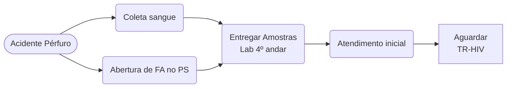
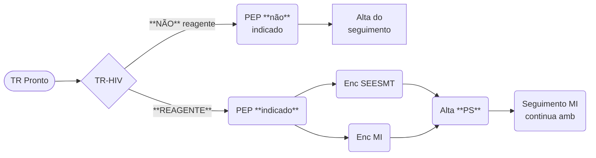

# Acidentes Com Material Biológico

{: .info-title }
> Atenção
>
> Se o paciente sofreu um acidente de trabalho **sem** exposição a material biológico, este não é o fluxo correto. Veja [fluxo específico](work_injury).

## Antes de resultado de TR-HIV

## Após resultado de TR-HIV

