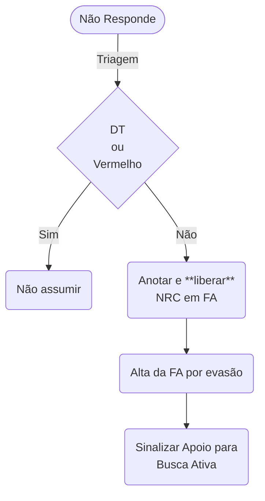

# Não Responde a Chamados

```mermaid
graph TD
  A([Não Responde]) -- Triagem --> B{DT<br>ou<br>Vermelho}
  B -- Sim --> C(Não assumir)
  B -- Não --> D(Anotar e **liberar**<br>NRC em FA)
  D --> E(Alta da FA por evasão)
  E --> F(Sinalizar Apoio para<br>Busca Ativa)
```
