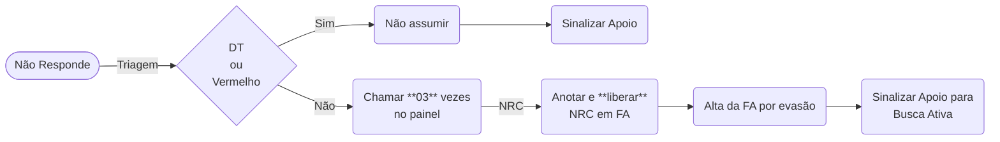

# Não Responde a Chamados

{: .warning }
**Não** espere resposta da busca ativa para dar alta. Dê alta e, se paciente fôr encontrado, a reverta.

## Observações

- **Sempre** anotar tentativas de chamado em FA e liberar.
- Usar CID-10 `Z00.0` ou `Z35.2` na HD.
- Preencher com `Não` o campo de Reavaliação.
- Em paciente sendo encontrado, reverta alta e siga atendimento seja por nova FA de 1º Atendimento, seja por Reavaliação.
